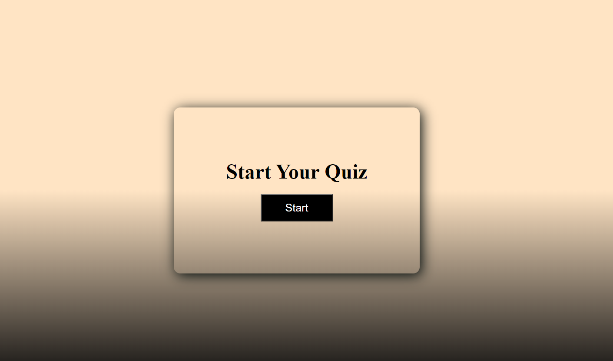

# Question-and-Answer-Game
Purpose
A question Game Quiz will allow you answer questions that are realated to some coding program languages.
1- will go to the next question when you answer a question 

2- will display correct or wrong while clicking an answer 

3- will update timer when answer is wrong 

4- will give you score whene you finish answering the questions 

# Built With
- HTML
- CSS
- Portfolio

# Exmple

## Game started

## when is wrong

## when is correct

## modal displayed

Contribution
Made by [Jugurta Maouchi] 2022.

©️2022 Quiz, Inc